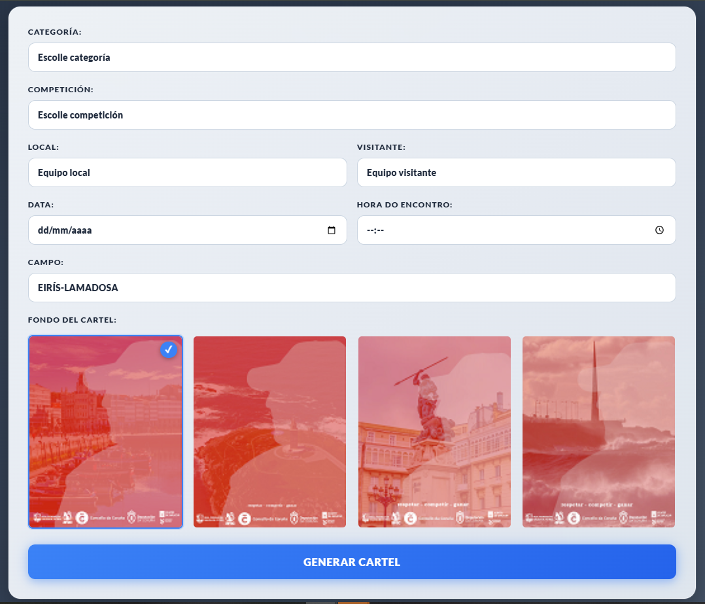
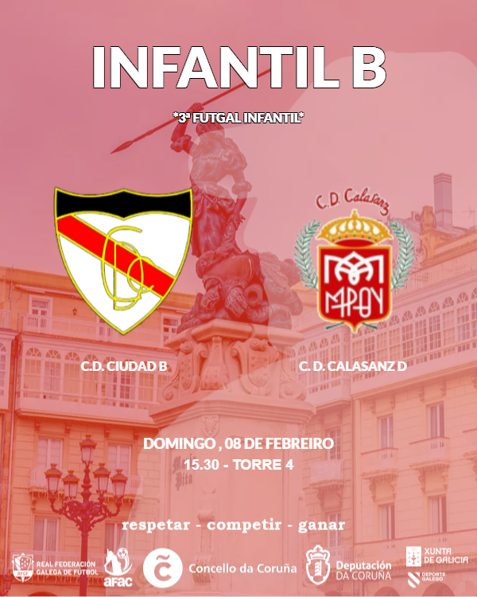
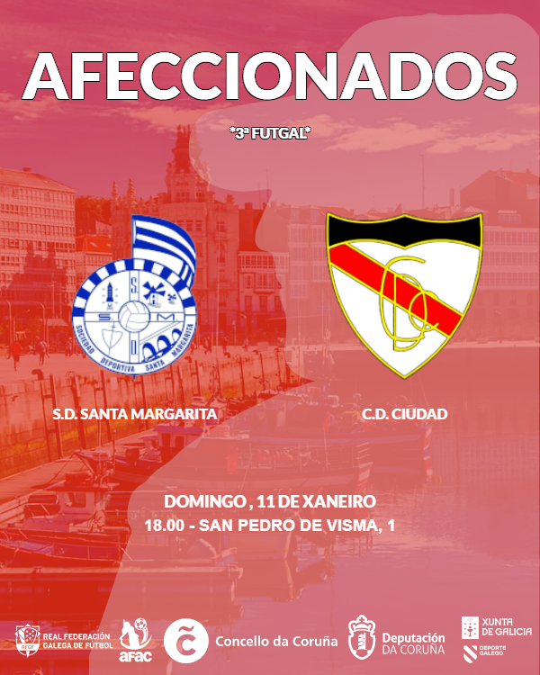
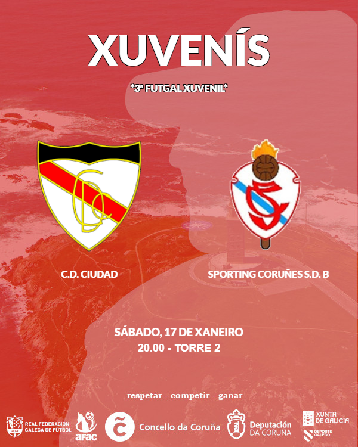

# ⚽ MatchDay Posters Generator

MatchDay Posters Generator is a web application created for **C.D. Ciudad de A Coruña** to streamline the creation of professional match posters for social media. The tool allows the club's staff to quickly generate custom posters by selecting teams, venues, dates, and background designs.

Originally developed in 2022 for internal club use, this project has been updated and modernized to showcase frontend development skills with vanilla JavaScript, responsive design, and dynamic content generation.

---

## 📱 Features

- 🏆 Select category and competition
- ⚽ Choose local and visiting teams with automatic badge display
- 📅 Set match date and time
- 🏟️ Select venue from predefined list or enter custom venue
- 🎨 Choose from 4 different poster backgrounds
- 📸 Generate high-quality poster screenshots
- 💾 Download posters as PNG images
- 📱 Fully responsive mobile-first design
- ✨ Modern UI

---

## 🛠️ Tech Stack   


- **Languages:**   
HTML5, CSS3, JavaScript (ES6+)
- **UI Framework:** Bootstrap 5
- **Fonts:** Google Fonts (Lato, Bebas Neue, Anton, and more)
- **Image Capture:** html2canvas
- **Architecture:** Modular JavaScript with separation of concerns
- **Design:** Mobile-first responsive layout

---

## 🧩 Project Structure

The project follows a clean modular structure:
```text

MatchDayPosterApp/

│   index.html
│   README.md
│
├───img
│   │   1.png
│   │   2.png
│   │   3.png
│   │   4.png
│   │
│   ├───crests
│   │       adcristorey.png
│   │       adculleredo.png
│   │       almeiras.png
│   │       atarteixo.png
│   │       ...
│   │
│   └───thumbnails
│           1mini.png
│           2mini.png
│           3mini.png
│           4mini.png
│
├───scripts
│       campos.js
│       capture.js
│       cartel.js
│       categoriaescollida.js
│       datescript.js
│       escudoslocal.js
│       escudovisitante.js
│       firstscript.js
│       fondoSelector.js
│       generarNuevo.js
│       horaycampo.js
│       html2canvas.js
│       utils.js
│
└───styles
        styles.css
        stylesold.css
```

---

## 📸 Screenshots

### Form Interface


### Generated Poster - María Pita


### Generated Poster - Marina


### Generated Poster - Torre



---

## 🎯 Key Features Explained

### Dynamic Form
- Category selection automatically populates relevant competitions
- Team selection displays corresponding badges
- Custom input fields for "Other" options in competition and venue

### Background Selection
- 4 pre-designed backgrounds with thumbnail previews
- Visual feedback with hover effects and active state
- Backgrounds optimized for web (600x750px)

### Poster Generation
- Real-time preview as user fills the form
- Maintains fixed dimensions (600x750px) regardless of screen size
- Horizontal scroll on mobile to preserve poster quality

### Screenshot & Download
- High-quality PNG export using html2canvas
- Download button appears after screenshot generation
- Automatic filename: `html2canvas.png`

---

## 💼 Real World Impact

This tool is actively used by C.D. Ciudad de A Coruña's social media team to create match day posters for Instagram, Facebook, and Twitter. It has:
- Reduced poster creation time from 15-20 minutes to under 2 minutes
- Ensured consistent branding across all match announcements
- Enabled non-designers to create professional-looking graphics

---

## 🚀 What I Learned

- Building responsive layouts with CSS Grid and Flexbox
- Working with modular JavaScript architecture
- Implementing dynamic form validation
- Using html2canvas for client-side image generation
- Managing state across multiple form inputs
- Creating elegant UI/UX with gradients and animations
- Mobile-first responsive design principles

---

## 🔮 Possible Improvements

- Backend integration for saving posters
- User accounts and poster history
- More background templates
- Custom font selection
- Social media sharing integration
- Multi-language support

---

## ⚙️ Installation & Usage

1. Clone the repository
```bash
git clone https://github.com/robmaasmarin/MatchDayPosterApp.git
```

2. Open `index.html` in a modern web browser

3. Fill in the match details:
   - Select category and competition
   - Choose local and visiting teams
   - Set date and time
   - Select venue
   - Pick a background design

4. Click "Generar Cartel" to preview

5. Click "Screenshot" to generate the image

6. Click "Download" to save the poster

---

## 👨‍💻 Author

Developed by **Roberto Abelleira Pesqueira**  

---

## 📄 License

This project is for academic and portfolio purposes.